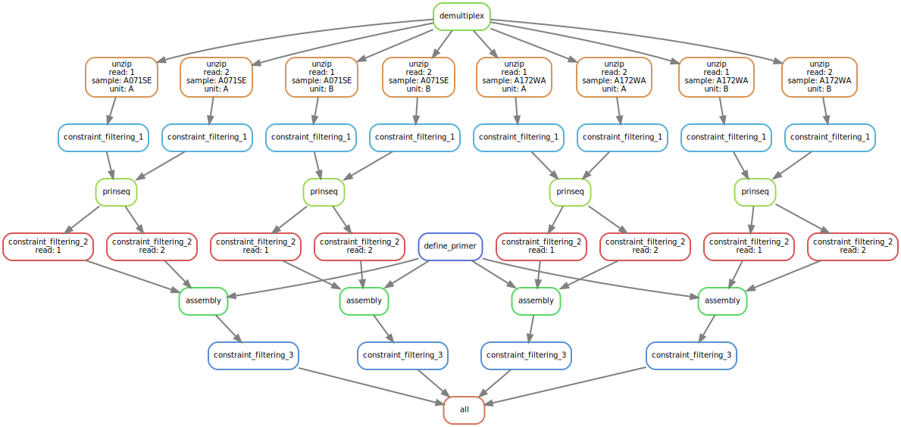

# RepairNatrix

Documentation see [@Natrix](https://github.com/MW55/Natrix)

*DAG of an example workflow for RapairNatrix

---
constraint_filtering 1-3 can be turned on optionally  
available constraints:  
* homopolymers
* overall_gc_content
* windowed_gc_content
* undesired_subsequences
* kmer_counting
too harsh filtering may result in execution errors of other rules (empty files)

