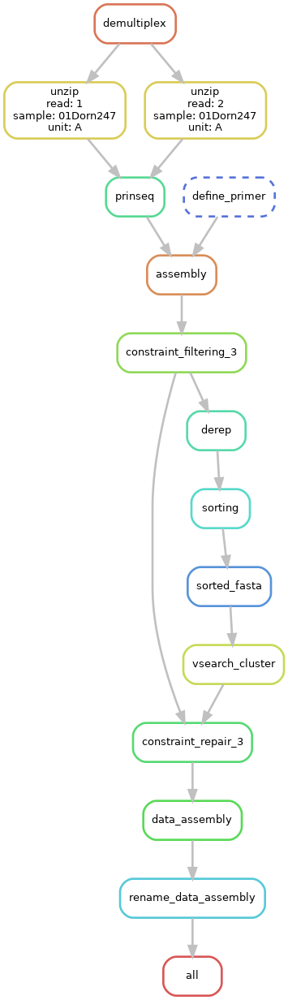
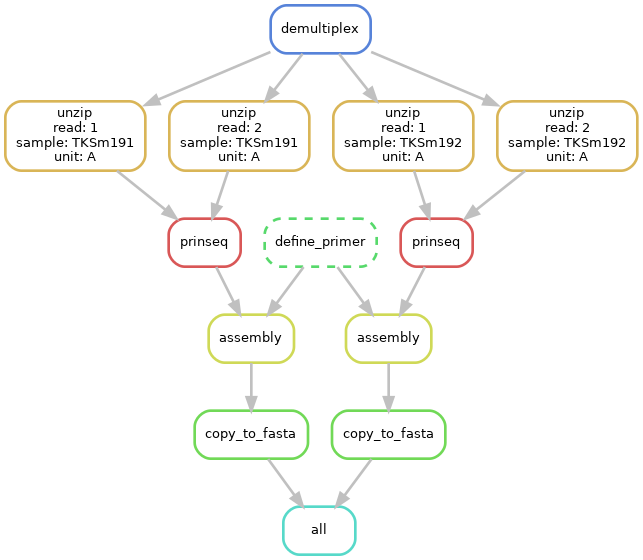
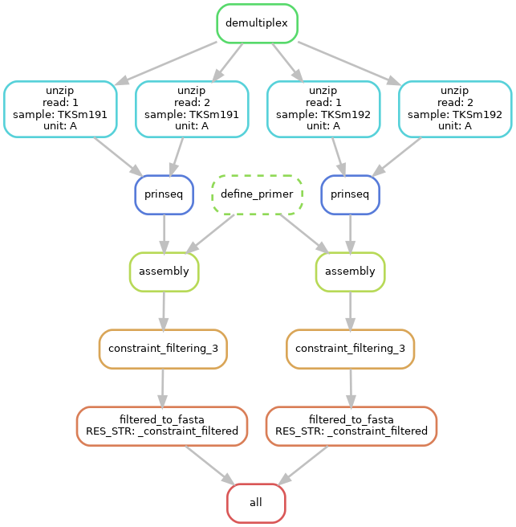
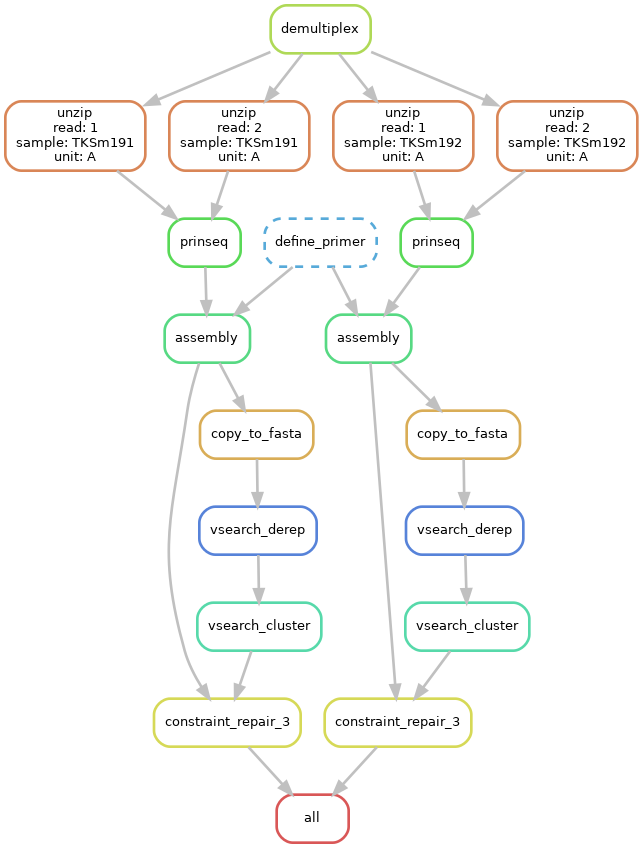

# RepairNatrix


*DAG of an example workflow for RepairNatrix

## Dependencies
* [Conda](https://conda.io/en/latest/index.html)
* [GNU screen](https://www.gnu.org/software/screen/) (optional)

Conda can be downloaded as part of the [Anaconda](https://www.anaconda.com/) or the [Miniconda](https://conda.io/en/latest/miniconda.html) plattforms (Python 3.7). We recommend to install miniconda3. 
Using Linux you can get it with:

```shell
$ wget https://repo.anaconda.com/miniconda/Miniconda3-latest-Linux-x86_64.sh
$ bash Miniconda3-latest-Linux-x86_64.sh
```

GNU screen can be found in the repositories of most Linux distributions:

* Debian / Ubuntu based: apt-get install screen
* RHEL based: yum install screen
* Arch based: pacman -S screen

All other dependencies will be automatically installed using conda environments and can be found in the corresponding environment.yaml files in the *envs* folder and the `natrix_repair.yaml` file in the root directory of the pipeline.

---

## Getting Started

To install RepairNatrix, you'll need the open-source package management system [conda](https://conda.io/en/latest/index.html).
After cloning this repository to a folder of your choice, it is recommended to create a general RepairNatrix conda environment with the accompanying `natrix_repair.yaml`. In the main folder of the cloned repository, execute the following command:

```shell
$ conda env create -f natrix_repair.yaml
```
This will create a conda environment containing all dependencies for Snakemake itself. 

With RepairNatrix comes an example primertable *example_data.csv*, configfile *example_data.yaml* and an example amplicon dataset in the folder *example_data*.

---
## Tutorial

### Prerequisites: dataset, primertable and configuration file
The FASTQ files need to follow a specific naming convention:
<p align="center"> 

</p>

```
samplename_unit_direction.fastq.gz
```
with:
* *samplename* as the name of the sample, without special characters.
* *unit*, identifier for split-samples (*A*, *B*). If the split-sample approach is not used, the unit identifier is simply *A*.
* *direction*, identifier for forward (*R1*) and reverse (*R2*) reads of the same sample. If the reads are single-end, the direction identifier is *R1*.

A dataset should look like this (two samples, paired-end, no split-sample approach):
```
S2016RU_A_R1.fastq.gz
S2016RU_A_R2.fastq.gz
S2016BY_A_R1.fastq.gz
S2016BY_A_R2.fastq.gz
```
Besides the FASTQ data from the sequencing process RepairNatrix needs a primertable containing the sample names and, if they exists in the data, the length of the poly-N tails, the sequence of the primers and the barcodes used for each sample and direction. Besides the sample names all other information can be omitted if the data was already preprocessed or did not contain the corresponding subsequence. RepairNatrix also needs a configfile file in YAML format, specifying parameter values for tools used in the pipeline.

The primertable, configfile and the folder containing the FASTQ files all have to be in the root directory of the pipeline and have the same name (with their corresponding file extensions, so *project*.yaml, *project*.csv and the *project* folder containing the FASTQ files). The first configfile entry (`filename`) also needs to be the name of the project.

### Running RepairNatrix

If you prefer to run the preperation script and snakemake manually, you have to start by activating the snakemake environment:

```shell
$ conda activate natrix_repair
```

Followed by running the preperation script, with *project* being the name of your project:

```shell
$ python3 create_dataframe.py <project>.yaml
```

This command will create the `units.tsv` file, containing the file information in a way that RepairNatrix can use it.

To start the main pipeline, type in:
```shell
snakemake --use-conda --configfile <project>.yaml --cores <cores>
```
with *project* being the name of your project and *cores* being the amount of cores you want to allocate for RepairNatrix to use.

Should the pipeline prematurely terminate (either because of an error or by deliberately stopping it) running the command above again will start the pipeline from the point it was terminated.

---

## Cluster execution
RepairNatrix can be run easily on a cluster system using either conda or the docker container.
Adding --cluster to the start command of RepairNatrix, together with a command to submit jobs (e. g. qsub) is enough for most 
cluster computing environments. An example command would be:

```shell
$ snakemake -s <path/to/Snakefile> --use-conda --configfile <path/to/configfile.yaml> --cluster "qsub -N <project name> -S /bin/bash/" --jobs 100
```

Further qsub arguments including brief explanations can be found under [qsub arguments](http://bioinformatics.mdc-berlin.de/intro2UnixandSGE/sun_grid_engine_for_beginners/how_to_submit_a_job_using_qsub.html).
For additional commands that should be executed for each job the argument --jobscript *path/to/jobscript.sh* can be used. 
A simple jobscript that sources before the execution of each job the bashrc and activates the snakemake environment looks like this:

```shell
#!/usr/bin/env bash

source ~/.bashrc
conda activate natrix_repair

{exec_job}
```

Instead of directly passing the cluster submission arguments to the snakemake command it is also possible to
write a profile that contains cluster commands and arguments. The use of profiles allows the assignment 
of rule-specific hardware requirements. For example, the BLAST rule benefits from a large amount of CPU cores, while other
rules, like AmpliconDuo, do not. With profiles, rules could be assigned a low amount of CPU cores as default, with rules
like BLAST being assigned a larger amount of cores. This allows optimal usage of cluster resources and shorter waiting times.
The creation of profiles is largely dependent on the software and hardware available on the cluster.
With a profile RepairNatrix can simply be run with

```shell
$ snakemake -s <path/to/Snakefile> --profile myprofile 
```
The Snakemake documentation contains a tutorial for [profile creation](https://snakemake.readthedocs.io/en/stable/executing/cli.html#profiles) 
and the [Snakemake profiles GitHub page](https://github.com/snakemake-profiles/doc) contains example profiles for different
cluster systems.

---

### Example workflow configurations




---

### Further information

constraint_filtering can be turned on optionally  
available constraints:  
* homopolymers
* overall_gc_content
* windowed_gc_content
* undesired_subsequences
* kmer_counting
##### too harsh filtering may result in execution errors of other rules (empty files) !

RepairNatrix uses a yaml file to specify the input files and parameters. 
A schema to validate yaml files including a description for all field can be found [here](https://github.com/umr-ds/RepairNatrix/example_data.yaml).
An example config can be found [here](https://github.com/umr-ds/RepairNatrix/example_data.yaml).

RepairNatrix is based on the Natrix amplicon processing pipeline, which can be found at [@Natrix](https://github.com/MW55/Natrix).
