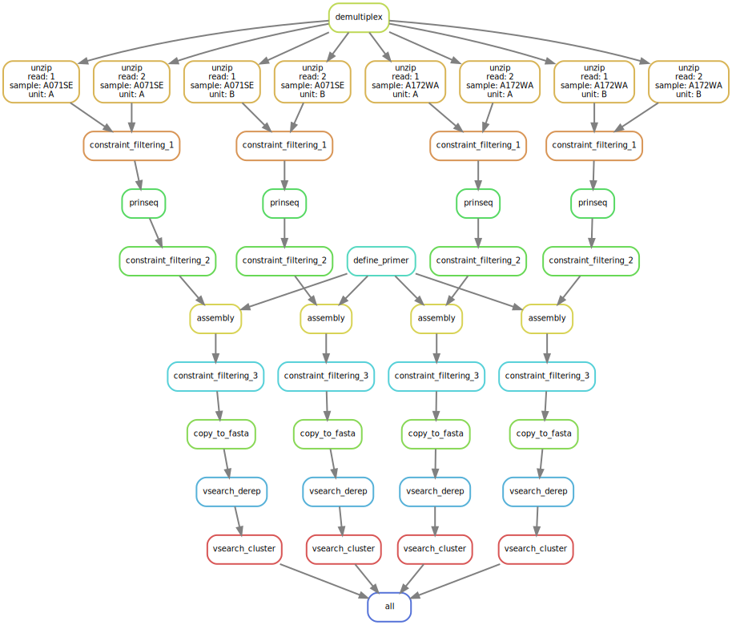

# RepairNatrix

Documentation see [@Natrix](https://github.com/MW55/Natrix)

*DAG of an example workflow for RapairNatrix

---
constraint_filtering 1-3 can be turned on optionally  
available constraints:  
* homopolymers
* overall_gc_content
* windowed_gc_content
* undesired_subsequences
* kmer_counting
too harsh filtering may result in execution errors of other rules (empty files)
---
other changes:
* added rules for vsearch derep & clustering with clustering_id option
* constraint_filtering: paired reads will be filtered together (if read 1 would be thrown away so would read 2, and vice versa)
* constraint_filtering: options for primer & sequence length, which are used in the filtering rules until assembly
* prinseq: option to trim to length (cut right side of trim)

